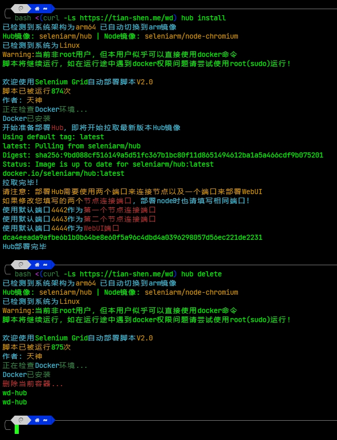

<h1 align="center">Selenium Grid Docker</h1>
<p align="center">
    <a href="https://github.com/sahuidhsu/selenium-grid-docker/stargazers" style="text-decoration:none" >
        
    </a>
    <a href="https://github.com/sahuidhsu/selenium-grid-docker/blob/main/LICENSE" style="text-decoration:none" >
        
    </a>
    
    
    
</p>
<h3 align="center">中文文档 | <a href="README_EN.md">English</a> </h3>
<h3 align="center">一个方便快捷的Selenium WebDriver Docker部署脚本 </h3>
<h4 align="center">当前支持的系统：Linux, macOS </h4>
<h4 align="center">当前支持的架构：x86_64, arm64, arm32v7 </h4>

## 使用方法：
### 免输入一键部署
#### 部署Hub
```shell
bash <(curl -Ls https://tian-shen.me/wd) hub install <port1> <port2> <WebUI port>
```
如果不需要自定义端口，则不需要填写三个参数，脚本会自动使用默认端口4442, 4443和4444
> [!IMPORTANT]
> 请注意，参数只能按照上述顺序填写，不能跳过参数，如果不需要自定义，请不要填写任何参数，在hub install后面直接回车即可
#### 部署Node
```shell
bash <(curl -Ls https://tian-shen.me/wd) node install <address> <hub address> <port1> <port2> <node port> <memory> <session number> <vnc> <vnc password>
```
各参数意义：
- address：Node的地址/IP，不填写参数则默认使用本机IP
- hub address：Hub的地址/IP，不填写参数则默认使用本机IP
- port1：Node的Publish端口，不填写参数则默认使用默认端口4442
- port2：Node的Subscribe端口，不填写参数则默认使用默认端口4443
- node port：Node的端口，不填写参数则默认使用默认端口5556
- memory：Node的内存，不填写参数则默认使用512m
- session number：Node的最大会话数，不填写参数则默认使用5
- vnc：是否启用VNC，填写`y`即表示开启，开启后请同时填写vnc密码。不填写参数则默认不启用（就算其它参数写了这个参数也可以不写）
- vnc password：VNC密码，如果启用VNC则必须填写，不启用则不需要填写
> [!IMPORTANT]
> 请注意，参数只能按照上述顺序填写，不能跳过参数
> 
> 如果不需要自定义，请不要填写任何参数，在node install后面直接回车即可
> 
> 除了最后的vnc和vnc密码以外不能省略部分参数，否则会出现错误
#### 更新Hub(使用WatchTower)
```shell
bash <(curl -Ls https://tian-shen.me/wd) hub update
```
#### 删除Hub
```shell
bash <(curl -Ls https://tian-shen.me/wd) hub delete
```
#### 更新Node(使用WatchTower)
```shell
bash <(curl -Ls https://tian-shen.me/wd) node update
```
#### 删除Node
```shell
bash <(curl -Ls https://tian-shen.me/wd) node delete
```
### 交互式运行
```shell
bash <(curl -Ls https://tian-shen.me/wd)
```
或
```shell
bash <(curl -Ls https://raw.githubusercontent.com/sahuidhsu/selenium-grid-docker/main/wd.sh)
```
如您的系统不支持以上语法，请尝试使用以下方法：
```shell
curl -Ls -o wd https://tian-shen.me/wd && chmod +x wd && ./wd
```

## 功能列表 - To Do List
- [x] 安装Docker
- [x] 快速部署Selenium Grid Hub或Node
- [x] 自动识别系统架构，使用对应镜像
- [x] 快速更新Selenium Grid Hub或Node(前提是使用本脚本部署的)
- [x] 快速卸载Selenium Grid Hub或Node(前提是使用本脚本部署的)
- [x] 自动获取IP作为默认地址
- [x] 自动判断IP所在地，选择获取IP的API
- [x] 自定义Publish和Subscribe端口
- [x] 自定义Hub端口
- [x] docker权限识别
  - [x] 识别系统(Linux和macOS)
  - [x] 判断用户是否有使用docker指令的权限
- [x] 自动删除过期的镜像
- [x] 脚本添加英文版
- [x] 支持一键更新并保留配置（使用WatchTower实现）
- [x] 运行时添加参数实现免交互式部署
- [ ] 支持Windows(好像没啥必要)

## 使用样例



## 给我买杯咖啡
[](https://ko-fi.com/ltyckts)